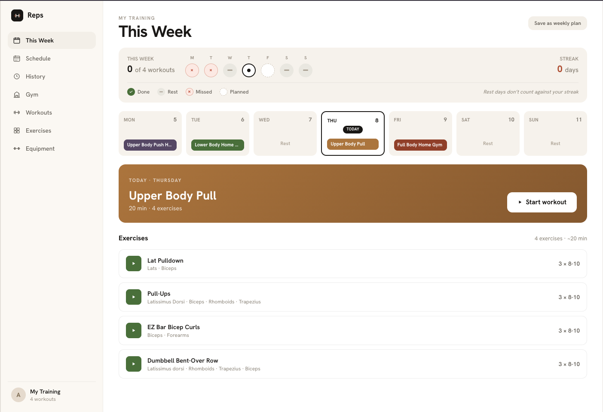
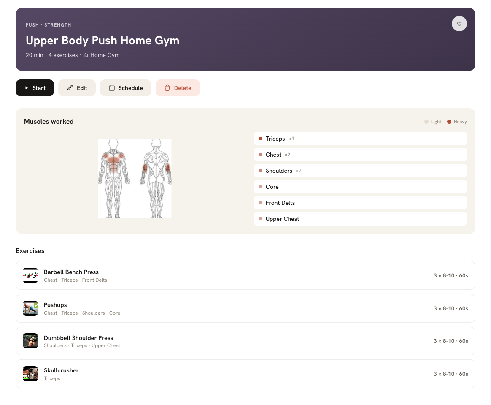
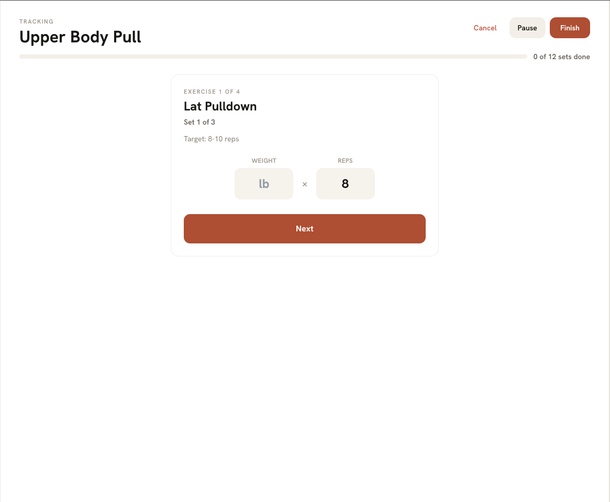

# Reps

[](https://github.com/carsongranese3/reps/actions/workflows/tests.yml)

A personal workout tracker. Build a workout, plan it on a calendar, track it set by set at the gym,
and see your history, streak and personal records afterward. It's an installable PWA built for one
person: one responsive app that works on a laptop and a phone.

### This Week



This Week is the home screen. The strip across the top marks each day as done, missed, rest or
planned, and counts how many of the week's planned workouts you've finished. The streak sits beside
it, and rest days don't break it. Below that is the week day by day, with each workout
color-coded by type, then today's workout and its exercises with a button to start it. The plan
comes from the Schedule: a date with its own workouts uses those, and every other date falls back
to the weekly template.

### A workout



This is a saved workout, with its type, estimated time and the gym it's built for in the header.
The muscle heat map shades the front and back of the body by how heavily the workout hits each
muscle. The list beside it counts how many exercises work each one, so the triceps (×4) show up
darker than the core. Underneath are the exercises with their sets, reps and rest. From here you
can start the workout, edit it, or put it on the calendar.

### Guided tracking



Guided is one of the two tracking styles, made for using a phone at the gym. It shows one set at a
time with the target rep range, and you enter the weight and reps and tap Next. A rest timer runs
between sets, and the bar at the top counts sets done across the whole workout. You can pause and
come back later, finish early, or cancel without logging anything. The other style, Checklist,
shows every set at once for logging in any order.

## Features

- **This Week:** today's workout, the week's plan, a streak, and how many planned days you've done.
- **Schedule:** a month calendar for planning workouts on specific dates, layered over a default
  weekly template. A date can hold several workouts, an explicit rest day, or nothing (falls back
  to the template).
- **Build:** design a workout from your exercise library with sets, reps and rest. The estimated
  duration updates as you build. Pick a gym, and exercises you can't do there are hidden.
- **Track:** two styles. **Checklist** logs everything freely; **Guided** goes one set at a time
  with a rest timer between sets. Pause and resume later, finish, or cancel.
- **History:** a weekly-volume chart (click a week to see its sessions), personal records, and
  editing or deleting past sessions. You can also log a workout you forgot to track.
- **Exercises:** a library you build yourself, with muscles worked, equipment, step-by-step
  instructions and a YouTube demo. A front-and-back **muscle heat map** shows what each exercise or
  workout hits.
- **Gyms and Equipment:** record what each gym has, so workouts can be filtered to what's actually
  available.
- **AI Autofill:** type an exercise name and Gemini fills in the category, equipment, muscles,
  instructions, tags and a demo video link for you to review before saving.

## Quick start

You need **Node 20.20+**. A [Gemini API key](https://aistudio.google.com/apikey) is optional; it
only powers Autofill.

```bash
git clone https://github.com/carsongranese3/reps.git
cd reps

npm install                      # server
npm install --prefix client      # client

cp server/.env.example server/.env   # optional: set GEMINI_API_KEY for Autofill
npm run seed                         # optional: starter exercises, workouts and gyms

npm run dev                      # API on :4000, app on http://localhost:5173
```

The Vite dev server proxies `/api` to the Express server. To add exercises in bulk:
`npm run import:exercises -- data/upper-body-additions.json`.

For everyday use, `npm run build` and then `npm start` serves the built app and the API from one
process.

## Tests

```bash
npm test
```

212 tests across 18 files, run with [Vitest](https://vitest.dev). Server tests call the real
Express routes with Supertest, and each test file gets its own throwaway database and media folder,
so tests never touch your data or each other. They cover the API routes, the schedule and streak
rules, PR detection, the database migrations, and the Gemini response parser.
Client tests cover the equipment matching and muscle-name mapping logic.

## Engineering notes

**One SQLite file, no ORM.** Express owns a single SQLite database (better-sqlite3, WAL mode)
accessed through plain prepared statements. SQLite has no array type, so each table mixes ordinary
columns with JSON-string columns. Exactly two functions per table cross that boundary:
`normalizeBody()` cleans and encodes a request before it's written, and `rowTo*()` decodes a row
and falls back to an empty array if a JSON column is ever corrupt. Everything else in the server and
client works with real arrays and objects.

**Migrations that run on every boot.** `server/db.js` checks each table's columns at startup and
adds anything missing, so an old database upgrades in place. When the equipment model changed shape
(a plain string, then a list, then groups), a one-time migration converted every existing row
instead of leaving old data behind.

**Equipment as AND-of-ORs.** An exercise lists the equipment groups it needs: every group is
required, and any one item in a group satisfies it. Bench press needs a barbell **and** a bench;
dips need a dip station **or** a bench. Separately, each piece of equipment can declare what it
also counts as (an adjustable bench counts as a bench). Whether an exercise is doable at a gym
combines both: expand the gym's equipment by those substitutes, then require every group to be
met. This took two redesigns to get right, and both are recorded in
[`docs/decisions.md`](docs/decisions.md).

**One source of truth for the week and the streak.** A date's plan is its own scheduled workouts if
any are set, otherwise the weekly template for that weekday. That rule, the streak and the "N of M
days" count live in one module (`server/lib/week.js`) shared by every endpoint that reports them,
so the numbers always agree. Dates are handled as plain `YYYY-MM-DD` strings and the client sends
its local date, which avoids time-zone and daylight-saving bugs on the server.

**Personal records, defined once.** A PR is a completed set heavier than any weight ever logged
for that exercise. Editing a past session recomputes its PRs against every *other* session, so a
session can't beat itself. One known limitation is documented rather than hidden: a workout logged
after the fact is compared against all sessions, not only earlier ones.

**The API key never reaches the browser.** Autofill goes through the app's own
`POST /api/exercises/autofill`, and the server calls Gemini. Without a key, the button says so
instead of failing. Nothing is saved until you review the suggestion and hit Save.

## How this was built

I designed the app and made the product calls: the storage design, the schedule and streak rules,
the PR definition, the equipment model, and the two tracking styles. Every decision is recorded with
its reasoning in [`docs/decisions.md`](docs/decisions.md), including the ones I later reversed.

The implementation was built with Claude Code, using a team of specialist agents (requirements,
backend, frontend, QA and others) coordinated through [`CLAUDE.md`](CLAUDE.md). The look started
as a prototype in Claude Design, saved in `design/`, and was rebuilt in Tailwind.

## Project layout

- `server/`: Express API. `db.js` (schema and migrations), `index.js` (routes), `lib/` (week and
  streak rules, PRs, duration estimates, Gemini, media), `test/`.
- `client/`: React + TypeScript + Vite + Tailwind PWA, using React Query for data fetching.
- `data/`: exercise sets for bulk import.
- `docs/`: [API contract](docs/api.md), [data shapes](docs/data-shapes.md),
  [design mapping](docs/design.md), and the [decisions log](docs/decisions.md).
- `specs/`: feature specs. `design/`: the original design prototype.

## Stack

TypeScript · React 18 · Vite · Tailwind CSS · React Query · Node · Express · SQLite (better-sqlite3)
· Gemini API · Vitest
